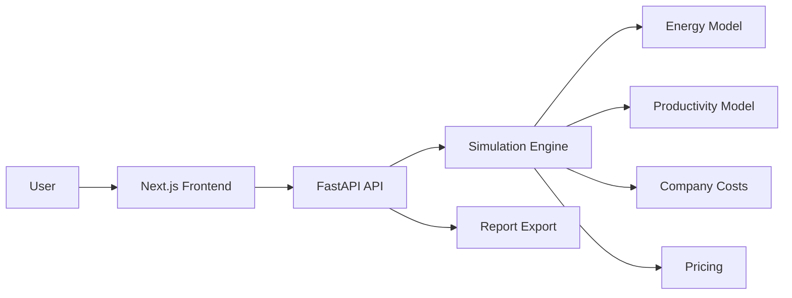

# WorkScale Simulator

**Educational open source simulator for comparing work schedules, worker energy, productivity, burnout, vacation, company costs, labor taxes and product/service pricing.**

[](https://github.com/claytongf/workscale-simulator/actions/workflows/backend.yml)
[](https://github.com/claytongf/workscale-simulator/actions/workflows/frontend.yml)
[](LICENSE)
[](https://buymeacoffee.com/botaficha)
[](https://github.com/claytongf/workscale-simulator/stargazers)

---

## Why This Project Exists

Discussions about work schedules often become ideological and simplistic. One side claims fewer hours always improve life quality; the other insists companies would collapse without long shifts. Both miss nuance.

**WorkScale Simulator** turns this debate into an interactive, transparent simulation. Users configure their own assumptions — energy, productivity, company costs, pricing — and the simulator compares trade-offs across schedules like **6×1, 5×2, 4×3, 12×36, part-time, freelance** and custom configurations.

The project **does not claim** which schedule is universally better. It shows **what happens under the user's assumptions**.

---

## Core Features

- 🎮 **Videogame-inspired energy bar** — worker energy drains on workdays and recharges on rest days
- 📊 **Productivity & output modeling** — gross and net output based on energy, experience, and tooling
- 🔥 **Burnout simulation** — long-term fatigue accumulates and impacts error rates
- 🏢 **Company cost engine** — salaries, taxes, benefits, training, absenteeism, turnover
- 💰 **Product pricing** — unit cost and final price based on production and desired margin
- 🌍 **Country presets** — editable labor cost estimates for Brazil, USA, UK, Germany, Japan, and the EU
- 📈 **Scenario comparison** — compare two or more schedules with absolute and percentage deltas
- ▶️ **Animated Simulation Mode** — play, pause, restart, and speed through daily energy, burnout, and output results for up to 3 scenarios
- 📄 **Report export** — JSON, CSV, and Markdown with assumptions and ethical disclaimers
- ✅ **Comprehensive tests** — 67+ unit and integration tests
- 🐳 **Docker support** — one-command setup with Docker Compose

---

## Screenshots

> Coming soon.

## Demo

> Coming soon.

## Video

> Coming soon.

---

## Tech Stack

### Backend

| Technology | Purpose |
|---|---|
| Python 3.12 | Core language |
| FastAPI | REST API framework |
| Pydantic v2 | Data validation and schemas |
| Pytest | Testing framework |
| Ruff | Linting and formatting |
| Mypy | Static type checking |
| Docker | Containerization |

### Frontend

| Technology | Purpose |
|---|---|
| Next.js 14 | React framework |
| TypeScript | Type safety |
| TailwindCSS | Utility-first styling |
| Recharts | Data visualization |
| React Hook Form + Zod | Form handling and validation |
| TanStack Query | Server state management |

---

## Architecture Overview



The simulation engine is **completely isolated** from API routes and frontend code. Routes delegate to services; services call the engine. No formulas exist in route handlers or React components.

---

## How the Simulator Works

1. The user configures a **worker profile** (productivity, experience, sleep, commute) and a **work schedule** (6×1, 5×2, 4×3, etc.).
2. The engine simulates each day over a configurable period (30, 90, or 365 days).
3. On **workdays**, energy drains from work and commute; on **rest days**, energy recovers from sleep and leisure.
4. **Burnout** accumulates over time from overwork and poor sleep, and reduces during vacations.
5. **Productivity** generates gross output based on energy, experience, and environment factors. Net output discounts error rate.
6. Optionally, **company costs** (salaries, taxes, benefits, overhead) and **pricing** (unit cost, desired margin, final price) are calculated.
7. Two or more scenarios can be **compared** with absolute and percentage deltas against a baseline.
8. In **Animated Simulation Mode**, the frontend animates the backend-provided `daily_results` day by day. One real second equals one simulated day by default, with speed controls for longer runs.

---

## Mathematical Model Summary

### Energy

```
energy_next = energy_current - work_cost - commute_cost - domestic_cost - stress_cost
              + sleep_recovery + rest_recovery + leisure_recovery + vacation_recovery

energy_next = min(100, max(0, energy_next))
```

### Productivity

```
gross_output = hours_worked × base_output_per_hour × worker_productivity_factor
               × experience_factor × energy_factor × tooling_factor × environment_factor

net_output = gross_output × (1 - error_rate)
```

### Company Costs

```
company_monthly_cost = Σ(employee_total_cost) + fixed_costs + variable_costs
                       + material_costs + operational_costs + rework_costs
                       + absenteeism_costs + turnover_costs
```

### Pricing

```
unit_cost   = company_monthly_cost / company_net_output
final_price = unit_cost / (1 - desired_margin)
```

> Full model documentation: [docs/03-mathematical-model.md](docs/03-mathematical-model.md)

---

## How to Run

### Quick Start with Docker

1. **Clone the repository:**

```bash
git clone https://github.com/claytongf/workscale-simulator.git
cd workscale-simulator
```

2. **Copy environment files:**

```bash
cp backend/.env.example backend/.env
cp frontend/.env.example frontend/.env.local
```

3. **Start services:**

```bash
docker compose up --build
```

4. **Access the system:**

| Service | URL |
|---|---|
| Frontend | http://localhost:3000 |
| Backend API | http://localhost:8000 |
| API Docs (Swagger) | http://localhost:8000/docs |
| Health Check | http://localhost:8000/health |

5. **Stop services:**

```bash
docker compose down
```

---

### Run Backend Locally

```bash
cd backend
python -m venv .venv
source .venv/bin/activate
pip install -e ".[dev]"
uvicorn app.main:app --reload
```

The API will be available at http://localhost:8000.

---

### Run Frontend Locally

```bash
cd frontend
npm install
cp .env.example .env.local
npm run dev
```

The frontend will be available at http://localhost:3000.

---

### Run Tests

**Backend:**

```bash
cd backend
pytest
```

**Frontend:**

```bash
cd frontend
npm run lint
npm run type-check
npm run build
```

---

## How to Use the Simulator

See the detailed usage guide: [docs/17-running-the-system.md](docs/17-running-the-system.md)

Quick summary:

1. Open the app at http://localhost:3000
2. Click **"Start Simulator"** on the home page
3. Choose a work schedule (6×1, 5×2, 4×3, 12×36, etc.)
4. Configure the worker profile (productivity, experience, sleep, commute)
5. Optionally add company cost assumptions and pricing margin
6. Run the simulation
7. Analyze energy, burnout, and output charts on the dashboard
8. Switch to Animated Simulation Mode to watch daily results progress visually
9. Compare up to 3 scenarios side by side, including synchronized animated playback
10. Export reports in JSON, CSV, or Markdown

---

## API Documentation

The API provides interactive documentation via Swagger UI at `/docs` when the backend is running.

### Endpoints

| Method | Path | Description |
|---|---|---|
| `GET` | `/health` | Health check |
| `POST` | `/api/simulations` | Run a single simulation |
| `POST` | `/api/simulations/compare` | Compare multiple scenarios |
| `GET` | `/api/countries/presets` | List country presets |
| `GET` | `/api/countries/presets/{key}` | Get a specific country preset |
| `POST` | `/api/reports/export/json` | Export report as JSON |
| `POST` | `/api/reports/export/csv` | Export report as CSV |
| `POST` | `/api/reports/export/markdown` | Export report as Markdown |

> Full API documentation: [docs/12-api.md](docs/12-api.md)

---

## Project Structure

```
workscale-simulator/
├── backend/
│   ├── app/
│   │   ├── main.py                   # FastAPI application
│   │   ├── core/                     # Configuration and exceptions
│   │   └── modules/
│   │       ├── company/              # Company cost engine
│   │       ├── country/              # Country presets (JSON data)
│   │       ├── energy/               # Energy model and formulas
│   │       ├── pricing/              # Pricing model and formulas
│   │       ├── productivity/         # Productivity model and formulas
│   │       ├── report/               # Report export (JSON/CSV/MD)
│   │       ├── schedule/             # Schedule presets and logic
│   │       └── simulation/           # Simulation orchestrator and API
│   ├── pyproject.toml
│   └── Dockerfile
├── frontend/
│   ├── src/
│   │   ├── app/                      # Next.js pages
│   │   ├── components/               # React components
│   │   │   ├── charts/               # Recharts visualizations
│   │   │   ├── dashboard/            # Summary and export
│   │   │   ├── forms/                # Scenario configuration
│   │   │   ├── game-ui/              # Energy/burnout bars
│   │   │   └── layout/               # App shell and header
│   │   ├── services/                 # API client
│   │   ├── schemas/                  # Zod validation schemas
│   │   └── types/                    # TypeScript type definitions
│   ├── package.json
│   └── Dockerfile
├── docs/                             # Project documentation
├── .github/
│   ├── workflows/                    # CI pipelines
│   ├── ISSUE_TEMPLATE/               # Bug, feature, formula, preset templates
│   └── pull_request_template.md
├── AGENTS.md                         # AI agent instructions
├── CONTRIBUTING.md                   # Contribution guidelines
├── docker-compose.yml                # Full-stack Docker setup
├── LICENSE                           # MIT License
└── README.md
```

---

## Roadmap

```
Phase  1: Documentation ✅
Phase  2: Simulation engine (Python) ✅
Phase  3: FastAPI API ✅
Phase  4: Company costs & pricing ✅
Phase  5: Frontend dashboard ✅
Phase  6: Country presets ✅
Phase  7: Advanced scenario comparison ✅
Phase  8: Tests & CI ✅
Phase  9: Report export ✅
Phase 10: README & repository polish ✅
Phase 11: Deploy & public presentation 🔜
```

### Planned for future phases

- PDF and PNG report export
- Shareable scenario links
- Social media image generation
- Presentation mode for video recording
- Database persistence (optional)
- User authentication (optional)

---

## Ethics and Limitations

> **This simulator is educational and experimental.**
>
> It does not replace labor, legal, accounting, tax, medical, psychological, or economic advice.
>
> Results depend on user-provided assumptions. The goal is scenario comparison, not absolute truth.

### Important principles

- **Productivity is not human worth.** A low productivity level does not make someone less valuable.
- **Energy is not willpower.** Low energy can result from poor sleep, long commutes, or lack of rest.
- **Experience is not intelligence.** Experience affects output and error rates, not cognitive ability.
- **Country presets are editable estimates.** They are not official tax calculators and should not be treated as legal guidance.

> Full ethics documentation: [docs/15-ethics-and-limitations.md](docs/15-ethics-and-limitations.md)

---

## Contributing

We welcome contributions! Please read [CONTRIBUTING.md](CONTRIBUTING.md) for guidelines on:

- Reporting bugs
- Requesting features
- Proposing formula changes
- Adding or updating country presets
- Running backend and frontend checks
- Coding and documentation standards
- Ethical guidelines

---

## Support

If you find this project helpful, please consider supporting its development:

- ⭐ **Star this repository** to show your support and help others discover it!
- ☕ **[Buy Me a Coffee](https://buymeacoffee.com/botaficha)** to help keep the project active.

[](https://buymeacoffee.com/botaficha)

---

## License

This project is licensed under the [MIT License](LICENSE).
