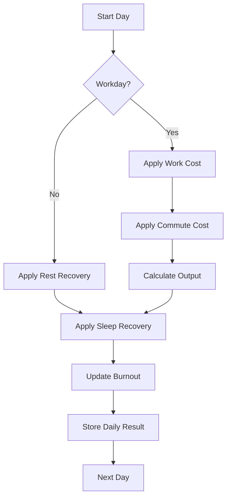

# 03 — Modelo matemático geral

O simulador é dividido em quatro blocos principais:

1. Energia do trabalhador.
2. Produtividade e produção.
3. Custos da empresa.
4. Preço final de produto ou serviço.

## Princípio fundamental

**Energia não é produtividade.**

A energia representa a capacidade física e mental disponível.

A produtividade representa quanto uma pessoa consegue produzir usando aquela energia.

Um trabalhador muito produtivo pode entregar mais que a média, mas ainda sofre efeitos de cansaço, sono ruim, deslocamento longo e falta de descanso.

## Fórmula geral de energia

```txt
energy_next =
energy_current
- work_cost
- commute_cost
- domestic_cost
- stress_cost
+ sleep_recovery
+ rest_recovery
+ leisure_recovery
+ vacation_recovery
```

Com limite:

```txt
energy_next = min(100, max(0, energy_next))
```

## Fórmula geral de produção

```txt
gross_output =
hours_worked
* base_output_per_hour
* worker_productivity_factor
* experience_factor
* energy_factor
* tooling_factor
* environment_factor
```

## Fórmula geral de produção líquida

```txt
net_output =
gross_output
* (1 - error_rate)
```

## Fórmula geral de custo da empresa

```txt
company_monthly_cost =
sum(employee_total_cost)
+ fixed_costs
+ variable_costs
+ material_costs
+ operational_costs
+ taxes_on_revenue
+ rework_costs
+ absenteeism_costs
+ turnover_costs
```

## Fórmula geral de custo unitário

```txt
unit_cost =
company_monthly_cost / company_net_output
```

## Fórmula geral de preço final

```txt
final_price =
unit_cost / (1 - desired_margin)
```

## Diagrama do loop de simulação



## Observação sobre modelos

Os modelos matemáticos devem começar simples no MVP, mas precisam ser fáceis de evoluir.

Toda fórmula deve ser:

- documentada;
- testada;
- parametrizável;
- transparente para o usuário.
