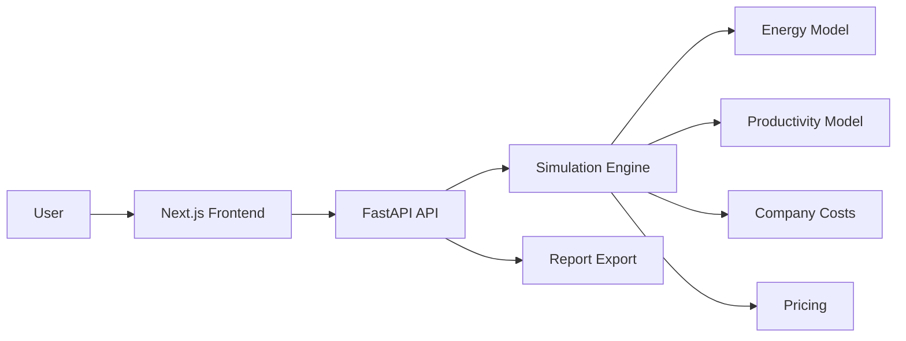

# 11 — Arquitetura e tecnologias

## Arquitetura geral



## Backend

Tecnologias:

```txt
Python
FastAPI
Pydantic
SQLAlchemy
PostgreSQL
Alembic
Pytest
Ruff
Mypy
Docker
```

## Frontend

Tecnologias:

```txt
Next.js
React
TypeScript
TailwindCSS
ShadCN UI
React Hook Form
Zod
Recharts ou Plotly
TanStack Query
```

## Infraestrutura

```txt
Docker Compose
GitHub Actions
PostgreSQL
Vercel para frontend
Render, Fly.io, Railway ou DigitalOcean para backend
```

## Estrutura do backend

```txt
backend/
├── app/
│   ├── main.py
│   ├── core/
│   │   ├── config.py
│   │   ├── database.py
│   │   └── exceptions.py
│   ├── modules/
│   │   ├── worker/
│   │   │   ├── schemas.py
│   │   │   ├── models.py
│   │   │   ├── service.py
│   │   │   └── routes.py
│   │   ├── schedule/
│   │   │   ├── schemas.py
│   │   │   ├── service.py
│   │   │   └── presets.py
│   │   ├── energy/
│   │   │   ├── schemas.py
│   │   │   ├── service.py
│   │   │   └── formulas.py
│   │   ├── productivity/
│   │   │   ├── schemas.py
│   │   │   ├── service.py
│   │   │   └── formulas.py
│   │   ├── company/
│   │   │   ├── schemas.py
│   │   │   ├── service.py
│   │   │   └── formulas.py
│   │   ├── pricing/
│   │   │   ├── schemas.py
│   │   │   ├── service.py
│   │   │   └── formulas.py
│   │   ├── country/
│   │   │   ├── schemas.py
│   │   │   ├── presets.py
│   │   │   └── service.py
│   │   └── simulation/
│   │       ├── schemas.py
│   │       ├── service.py
│   │       └── routes.py
│   └── tests/
├── alembic/
├── pyproject.toml
├── Dockerfile
└── docker-compose.yml
```

## Estrutura do frontend

```txt
frontend/
├── src/
│   ├── app/
│   │   ├── page.tsx
│   │   ├── simulator/
│   │   │   └── page.tsx
│   │   ├── compare/
│   │   │   └── page.tsx
│   │   ├── countries/
│   │   │   └── page.tsx
│   │   └── scenarios/
│   │       └── page.tsx
│   ├── components/
│   │   ├── layout/
│   │   ├── forms/
│   │   ├── charts/
│   │   ├── game-ui/
│   │   │   ├── energy-bar.tsx
│   │   │   ├── burnout-bar.tsx
│   │   │   └── stat-card.tsx
│   │   └── dashboard/
│   ├── services/
│   │   └── api.ts
│   ├── schemas/
│   │   └── scenario.schema.ts
│   ├── types/
│   └── lib/
├── package.json
└── Dockerfile
```
