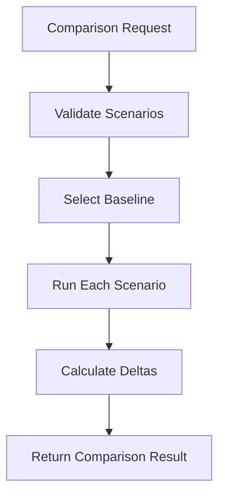

# 12 — API

> [!NOTE]
> As of Phase 4, individual simulation and scenario comparison endpoints support optional company costs and pricing calculations. Country presets are planned for subsequent phases.

## Criar simulação

```txt
POST /api/simulations
```

### Request

```json
{
  "period_days": 365,
  "worker": {
    "job_type": "software_development",
    "monthly_salary": 6000,
    "productivity_level": 7,
    "experience_level": 8,
    "sleep_hours": 7,
    "commute_hours": 1.5
  },
  "schedule": {
    "type": "5x2",
    "hours_per_day": 8,
    "vacation_days_per_year": 30
  },
  "company": {
    "number_of_employees": 10,
    "gross_salary": 6000.0,
    "total_employer_tax_rate": 0.20,
    "benefits": 500.0,
    "fixed_costs": 30000.0
  },
  "pricing": {
    "desired_margin": 0.3
  }
}
```

### Response

```json
{
  "summary": {
    "average_energy": 72.5,
    "final_energy": 68.2,
    "burnout": 22.4,
    "gross_output": 18400,
    "net_output": 17120,
    "average_error_rate": 0.07,
    "total_hours_worked": 176,
    "total_free_time": 320
  },
  "daily_results": [],
  "company": {
    "employer_taxes": 1200,
    "vacation_provision": 500,
    "thirteenth_salary_provision": 500,
    "employee_total_cost": 8500,
    "rework_costs": 320,
    "company_monthly_cost": 95000
  },
  "pricing": {
    "unit_cost": 48.32,
    "final_price": 69.02
  }
}
```

## Comparar cenários

```txt
POST /api/simulations/compare
```

### Request

```json
{
  "baseline_scenario_name": "Cenário A",
  "scenarios": [
    {
      "name": "Cenário A",
      "simulation": {
        "period_days": 30,
        "worker": {
          "job_type": "office",
          "productivity_level": 5,
          "experience_level": 5
        },
        "schedule": {
          "type": "5x2",
          "hours_per_day": 8.0
        }
      }
    },
    {
      "name": "Cenário B",
      "simulation": {
        "period_days": 30,
        "worker": {
          "job_type": "office",
          "productivity_level": 5,
          "experience_level": 5
        },
        "schedule": {
          "type": "6x1",
          "hours_per_day": 8.0
        }
      }
    }
  ]
}
```

### Response

```json
{
  "baseline_scenario_name": "Cenário A",
  "scenarios": [
    {
      "name": "Cenário A",
      "summary": {
        "average_energy": 85.0,
        "final_energy": 83.2,
        "burnout": 5.0,
        "gross_output": 160.0,
        "net_output": 150.0,
        "average_error_rate": 0.0625,
        "total_hours_worked": 160.0,
        "total_free_time": 120.0
      },
      "company": null,
      "pricing": null
    },
    {
      "name": "Cenário B",
      "summary": {
        "average_energy": 70.0,
        "final_energy": 65.0,
        "burnout": 15.0,
        "gross_output": 180.0,
        "net_output": 168.0,
        "average_error_rate": 0.0667,
        "total_hours_worked": 200.0,
        "total_free_time": 80.0
      },
      "company": null,
      "pricing": null
    }
  ],
  "deltas": [
    {
      "scenario_name": "Cenário B",
      "compared_to": "Cenário A",
      "deltas": [
        {
          "metric": "average_energy",
          "baseline_value": 85.0,
          "scenario_value": 70.0,
          "absolute_difference": -15.0,
          "percentage_difference": -17.647,
          "direction": "lower"
        }
      ]
    }
  ]
}
```

### Diagrama do fluxo de comparação



## Listar presets de países

```txt
GET /api/countries/presets
```

Retorna uma lista resumida dos presets de países disponíveis (chave, código de país, nome, nome do preset e moeda).

## Obter detalhes de preset de país

```txt
GET /api/countries/presets/{preset_key}
```

Retorna os detalhes completos validados do preset correspondente à chave fornecida. Se não for encontrado, retorna `404 Not Found`.

> [!NOTE]
> Os presets de países são estimativas educacionais e não substituem assessoria contábil, jurídica, tributária ou trabalhista profissional.


## Exportar Relatórios

```txt
POST /api/reports/export/json
POST /api/reports/export/csv
POST /api/reports/export/markdown
```

### Request Payload (`ReportExportRequest`)

```json
{
  "title": "Relatório WorkScale",
  "description": "Uma descrição opcional",
  "simulation": { ... },
  "comparison": { ... },
  "include_daily_results": true,
  "include_assumptions": true,
  "include_limitations": true
}
```

- **JSON Response**: Retorna `{ filename, content_type: "application/json", data: { ... } }`
- **CSV/Markdown Response**: Retorna `{ filename, content_type: "text/csv" | "text/markdown", content: "..." }`

> [!NOTE]
> As exportações em PDF e imagens PNG/Redes Sociais estão planejadas como trabalho futuro (Fase 10).


## Resultado diário

Cada dia da simulação deve conter:

```txt
day
is_workday
is_rest_day
is_vacation
hours_worked
hours_slept
commute_hours
energy_start
energy_end
burnout
gross_output
net_output
error_rate
free_time
income
company_cost
unit_cost
final_price
```
